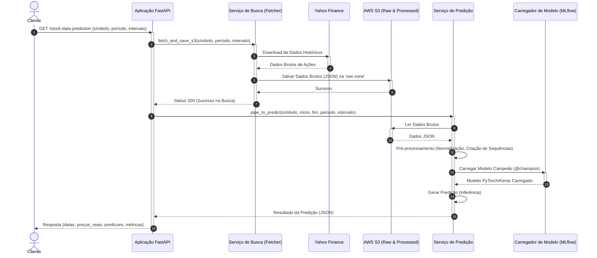

# 🔄 Fluxo de Uso da API

Este diagrama ilustra o fluxo ponta-a-ponta de uma requisição ao endpoint `/stock-data-prediction`, detalhando como os dados são buscados, processados e como as previsões são geradas utilizando a arquitetura AWS.

### Descrição dos Componentes

1. **Cliente**: Usuário final ou sistema externo que consome a API.
2. **Aplicação FastAPI**: Ponto de entrada (Gateway) que orquestra os pedidos.
3. **Serviço de Busca (Fetcher)**: Responsável por obter os dados mais recentes do Yahoo Finance para garantir que a predição use dados atualizados.
4. **AWS S3**: Armazenamento durável usado como Data Lake (camadas Raw e Trusted) e para artefatos do MLflow.
5. **Serviço de Predição**: Núcleo de inteligência que prepara os dados e executa o modelo.
6. **Carregador de Modelo**: Interage com o MLflow para baixar o modelo marcado como produção (`@champion`) dinamicamente.
